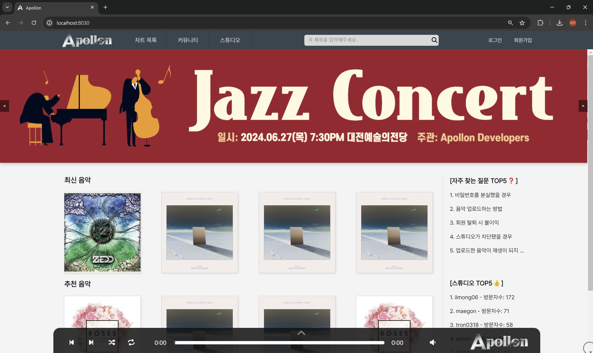
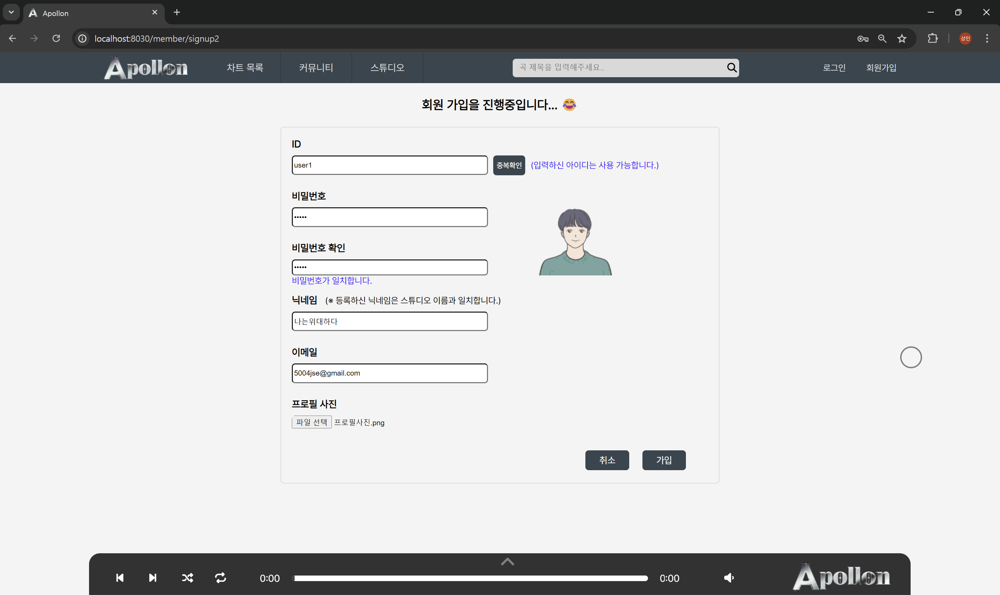
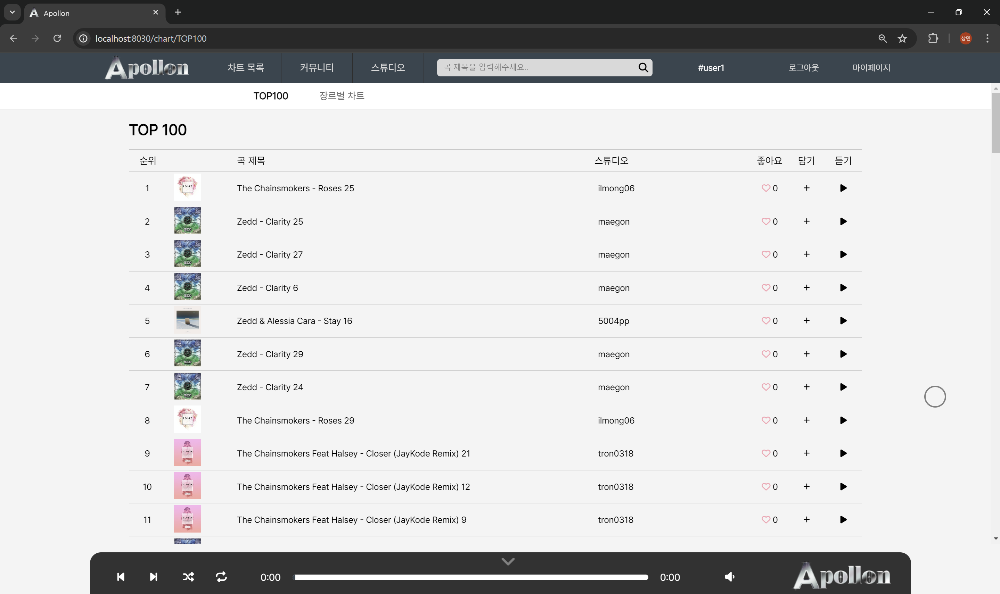
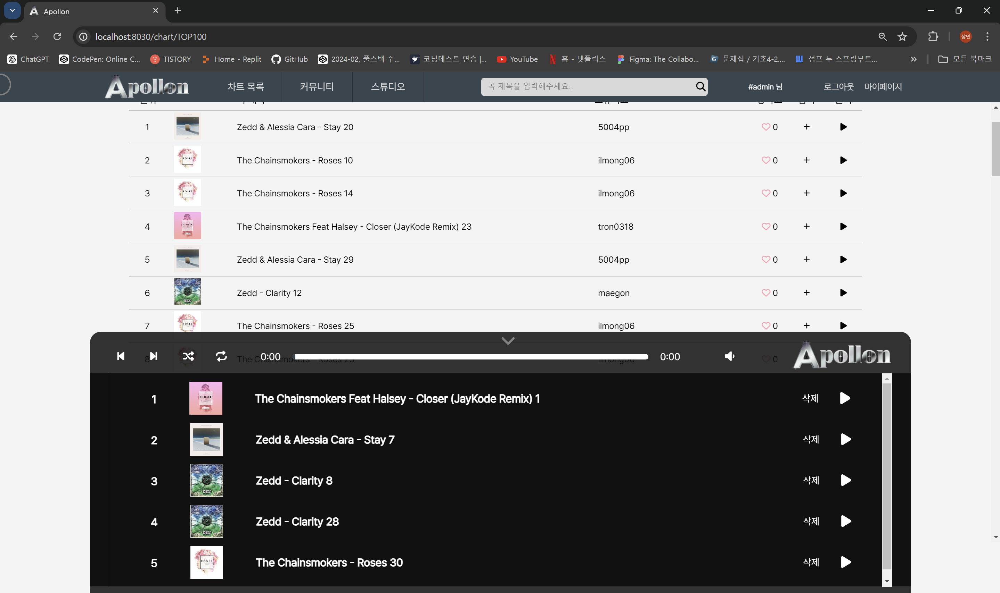

# 

## 🚀프로젝트 명 : Apollon
- 웹 URL : localhost:8030
- DB PORT : 3306
- DB username : root
- 데이터베이스 이름 : apollon_dev

## 📢 프로젝트 개요
- 스프링부트를 이용하여 만든 음악 커뮤니티 웹 사이트
- 다양한 음악 장르의 창작자들이 손쉽게 자신의 자작곡을 업로드하고 공유할 수 있는 웹 사이트
- 다양한 음악을 검색하고 스트리밍할 수 있는 기능을 통해 청취자들이 원하는 음악을 쉽게 찾고 감상할 수 있도록 지원
- 창작자와 청취자 간의 피드백과 소통을 장려하여 활발한 음악 커뮤니티를 형성
- 자작곡 외에도 여러 장르별 원곡들도 함께 청취 가능

## ⏱️개발 기간

- 전체 개발 기간 : 2024-05-27 ~ 2024-06-27
- UI 구현 : 2024-05-27 ~ 2024-06-27
- 기능 구현 : 2024-05-27 ~ 2024-06-27

## ⚙ 개발 환경
- 운영체제 : Windows 10, 11
- 통합개발환경(IDE) : IntelliJ
- JDK 버전 : JDK 17
- 데이터 베이스 : MySQL
- 빌드 툴 : Gradle
- 관리 툴 : GitHub


## 🔌 Dependencies
- Spring Boot DevTools
- Lombok
- Spring Data JPA
- MariaDB Driver
- Spring Security
- Spring Web
- Oauth2-client
- Thymeleaf
- Validation


## 💻 기술 스택
- 백엔드
    - SpringBoot, Spring Security, Spring Data JPA
- 프론트엔드
    - HTML, CSS, Javascript, Bootstrap, Thymeleaf, jQuery
- 데이터베이스
    - MariaDB, MySQL Workbench
    - MySQL, SQLyog, DBeaver


## 🛠 DB 설계
- Member (회원)
- Music (음악)
- Studio (스튜디오)
- Comment (방명록)
- Post (커뮤니티)
- PlayList (플레이리스트)


## 👨‍👩‍👧‍👦 팀원 구성

<div align="center">

|                                                               **박상민**                                                               |                                                                **박지완**                                                                |                                                               **임재원**                                                                |                                                               **최아정**                                                                |
|:-----------------------------------------------------------------------------------------------------------------------------------:|:-------------------------------------------------------------------------------------------------------------------------------------:|:------------------------------------------------------------------------------------------------------------------------------------:|:------------------------------------------------------------------------------------------------------------------------------------:|
| [ <br/> @psm817](https://github.com/psm817) | [ <br/> @tron0318](https://github.com/tron0318) | [ <br/> @maegon](https://github.com/maegon) | [ <br/> @ilmong06](https://github.com/ilmong06) |

</div>

## 🧑‍🏫 역할 분담

### 🍇 박상민 (조장)

- **UI**
  - 페이지 : 스튜디오, 마이페이지
- **기능**
  - 나만의 스튜디오 관리
  - 스튜디오 내 유저 검색을 통한 타 스튜디오 방문
  - 스튜디오 차단/활성화 기능
  - 스튜디오 내 회원의 음악 업로드, 수정, 삭제
  - 스튜디오 내 음악 상세 정보 확인
  - 스튜디오 내 방명록 조회, 작성, 삭제
  - 스튜디오 및 음악 좋아요 기능
  - 마이페이지를 통한 개인 프로필 수정 및 회원 탈퇴
  - 메인페이지 내 최신 및 추천 음악 리스팅
  - 메인페이지 내 자주 찾는 질문 및 인기 스튜디오 리스팅
  - 플레이리스트에 사용자가 담은 음악 리스팅

<br>

### 🌍 박지완

- **UI**
  - 페이지 : 커뮤니티
- **기능**
  - 공지 / 자유 / 친목 게시판 구분
  - 게시물 등록, 수정, 삭제
  - 관리자 권한을 통한 전체 게시물 관리
  - 회원 별 커뮤니티 활동 기록 열람 기능
  - 커뮤니티 상단에 '공지사항' 고정
  - 커뮤니티 우측에 조회순으로 인기있는 게시물 리스팅
  - 등록된 게시물에 대한 댓글 기능

<br>

### 🎗️ 임재원

- **UI**
  - 페이지 : 메인 페이지, 차트 목록
- **기능**
  - 메인페이지 상단 헤더, 하단 플레이리스트 구현
  - 마우스 cursor 효과 적용
  - 차트 목록 내 좋아요(추천) 순으로 TOP100 리스팅
  - 차트 목록 내 음악 장르별 노래 리스팅
  - 차트 목록 내 음악 담기를 통해 플레이리스트에 음악 추가
  - 스튜디오 내 회원의 음악 업로드 기능

<br>

### ☎️ 최아정

- **UI**
  - 페이지 : 로그인, 회원가입, 임시비밀번호 발급
- **기능**
  - 일반 회원 및 카카오, 네이버, 구글을 통한 소셜 로그인 기능
  - 마이페이지를 통한 소셜로그인 계정 정보 수정
  - 비밀번호 분실 시, 임시 비밀번호 이메일로 발송
  - 아이디 기억하기 기능
  - 회원가입 전 약관동의 및 저작권 법률 고지 안내
  - 약관동의 후 일반 회원가입 기능
  - 고정 헤더에서 전체 음악 검색 기능
  - 플레이리스트 내 음악 재생, 일시정지, 반복 기능

<br>

## 프로젝트 전체 구조

```
├── README.md
├── build.gradle
├── .gitignore
├── gradlew.bat
├── gradlew
│
└── src.main
     ├── java.com.example.Apollon
           ├── ApollonApplication.java
           ├── domain
                  ├── comment
                          ├── contorller.CommentController.java
                          ├── entity.Commnet.java
                          ├── form.CommentForm.java
                          ├── repository.CommentRepository.java
                          ├── service.CommentService.java
                  ├── email
                        ├── EmailController.java
                        ├── EmailMessage.java
                        ├── EmailResponseDto.java
                        ├── EmailService.java
                  ├── home
                        ├── contorller.HomeController.java
                  ├── member
                        ├── contorller.MemberController.java
                        ├── contorller.UsernameCheckController.java
                        ├── entity.Member.java
                        ├── repository.MemberRepository.java
                        ├── service.MemberService.java
                  ├── music
                        ├── contorller.MusicController.java
                        ├── entity.Music.java
                        ├── repository.MusicRepository.java
                        ├── service.MusicService.java
                  ├── playlist
                        ├── contorller.PlaylistController.java
                        ├── entity.Playlist.java
                        ├── repository.PlaylistRepository.java
                        ├── service.PlaylistService.java
                  ├── post
                        ├── contorller.PostController.java
                        ├── entity.BoardType.java
                        ├── entity.Post.java
                        ├── entity.PostComment.java
                        ├── entity.PostForm.java
                        ├── repository.PostCommnetRepository.java
                        ├── repository.PostRepository.java
                        ├── service.PostCommentService.java
                        ├── service.PostService.java
                  ├── studio
                        ├── contorller.StudioController.java
                        ├── entity.Studio.java
                        ├── repository.StudioRepository.java
                        ├── service.StudioService.java
           ├── global
                  ├── config
                          ├── WebMvcConfig.java
                  ├── initData
                          ├── DataFileUtils.java
                          ├── Dev.java
                          ├── TestFileUtils.java
                          ├── TestFileUtilsConfig.java
                  ├── jpa
                       ├── BaseEntity.java
                  ├── security
                          ├── CustomOAuth2UserService.java
                          ├── SecurityConfig.java
                          ├── UserSecurityService.java
                  ├── DataNotFoundException.java
    ├── resource
            ├── static
                   ├── chart
                          ├── genreChart.css
                          ├── top100.css
                   ├── comment
                          ├── comment.css
                          ├── comment_detail.css
                   ├── images
                          ├── login
                          ├── slide_img
                          ├── uploads
                          ├── ApollonLogo.png
                          ├── ApollonLogo_dark.png
                          ├── My project.png
                          ├── none.png
                          ├── studio_img.png
                   ├── member
                         ├── login.css
                         ├── myPage.css
                         ├── password.css
                         ├── signup.css
                         ├── signup2.css
                   ├── music
                         ├── musicDetail.css
                         ├── upload_form.css
                   ├── post
                         ├── postDetail.css
                         ├── postLayout.css
                         ├── postList.css
                         ├── postProfile1.css
                         ├── postWrite.css
                   ├── footerStyle.css
                   ├── headerStyle.css
                   ├── mainPage.css
                   ├── studio.css
                   ├── style.css
            ├── templates
                    ├── chart
                          ├── genreChart.html
                          ├── TOP100.html
                    ├── comment
                            ├── comment_detail.html
                            ├── comment_form.html
                    ├── member
                           ├── login.html
                           ├── myPage.html
                           ├── reset-password.html
                           ├── signup.html
                           ├── signup2.html
                           ├── signup_modify.html
                           ├── signup_modify2.html
                    ├── music
                          ├── modify_form.html
                          ├── musicDetail.html
                          ├── musicDetail_form.html
                          ├── upload_form.html
                    ├── post
                          ├── post_detail.html
                          ├── post_list.html
                          ├── post_modifyForm.html
                          ├── post_profile.html
                          ├── post_write.html
                    ├── sendmail
                            ├── password.html
                    ├── studio
                           ├── studio_detail.html
                    ├── footer.html
                    ├── header.html
                    ├── layout.html
                    ├── mainPage.html
            ├── application.yml
            ├── application-dev.yml
            ├── application-prod.yml
            ├── application-secret.yml (비공개)
            ├── application-secret.yml.default
```

## 작업 관리 방법

- GitHub Projects와 Issues를 사용하여 진행 상황을 공유했습니다.
- 매일 본인의 작업 양을 소화하고 각자 구현한 기능을 서로 테스트하며 프로그램의 신뢰성을 높였습니다.


## 페이지별 기능 소개

### [메인화면]
- 서비스 접속 초기화면으로 화면 페이지의 기본 구조는 상단 헤더, 중간 본문, 하단 플레이리스트로 구분되어 있습니다.
  - 상단 헤더는 '차트 목록', '커뮤니티', '스튜디오', '로그인', '회원가입' 메뉴가 구성되어 있습니다.
  - 상단 헤더에는 음악 제목에 대한 모든 검색이 가능한 검색창이 포함되어 있습니다.
  - 메인화면 중간 본문은 광고 및 홍보 배너와 최신 & 추천 음악, 자주 찾는 질문 & 인기 스튜디오가 나열되어 있습니다.
  - 하단 플레이리스트는 실제 회원이 담은 노래를 재생하는 플레이바입니다.
- 서비스 미로그인 시 진입을 제한한 메뉴가 존재합니다.
  - 로그인이 되어 있지 않은 경우 : 스튜디오, 곡 정보 열람 불가, 플레이리스트 재생 불가
  - 로그인이 되어 있는 경우 : 모든 메뉴 진입 가능

| 메인화면                                                          |
|---------------------------------------------------------------|
|  |

<br>

### [회원가입]
- 회원가입 버튼과 동시에 이용약관 및 개인정보 수집, 저작권 안내애 대한 동의서 제출이 요구됩니다.
- 약관동의의 동의 후 일반 회원가입을 진행합니다.
- 모든 항목에 대한 유효성 검사를 적용합니다.
- ID는 중복확인을 필수로, 비밀번호는 비밀번호 확인절차를 거칩니다.
- 프로필 사진을 선택하면 화면에서 예시된 이미지를 보여줍니다.
- 회원가입이 완료되면 로그인 화면으로 이동과 동시에 회원가입 시 입력한 이메일 주소로 환영 메일이 전송됩니다.

| 회원가입                                                               |
|--------------------------------------------------------------------|
|  |
|  |

<br>

### [로그인]
- ID와 PW를 통한 로그인을 수행합니다.
- 카카오, 네이버, 구글을 통한 소셜 로그인은 버튼을 눌러 각 플랫폼에 로그인하면 자동으로 계정 생성됩니다.
- 아이디 기억하기 체크박스를 통해 로그아웃 시에도 본인이 로그인했던 아이디를 기억합니다.
- 비밀번호 찾기를 통해 최초 회원가입 시 입력한 이메일 주소로 임시 비밀번호를 전송합니다.
- 로그인에 성공하면 메인페이지 화면으로 이동합니다.

| 로그인                                                          |
|--------------------------------------------------------------|
|  |

<br>

### [마이페이지]
- 로그인이 되어있는 사용자만 마이페이지에 진입할 수 있습니다.
- 회원의 ID, 닉네임, 이메일, 프로필사진 정보를 제공합니다.
- 회원탈퇴 버튼을 통해 실제 회원 탈퇴가 진행됩니다.
- 프로필 수정 버튼을 통해 ID를 제외한 모든 정보를 변경할 수 있습니다.
- 소셜로그인의 경우 프로필 수정은 닉네임과 프로필 사진만 가능합니다.
- 프로필 사진은 등록되지 않을 경우 기본 이미지가 등록됩니다.

| 마이페이지                                                          |
|----------------------------------------------------------------|
|  |

<br>

### [로그아웃]
- 상단 헤더의 로그아웃 버튼을 클릭하면 로그아웃과 동시에 메인페이지로 이동합니다.

| 로그아웃                                                          |
|---------------------------------------------------------------|
|  |

<br>

### [차트 목록]
- TOP100과 장르별 차트를 보여줍니다.
- TOP100은 음악의 좋아요(추천) 수가 많은 순서대로 나열됩니다.
- 장르별 차트는 음악의 장르별로 등록된 음악이 모두 나열됩니다.
- 로그인을 하지 않았을 때 TOP100에서 음악을 플레이리스트에 담을 수 없습니다.
- 로그인을 하였을 때 TOP100에서 음악을 플레이리스트에 담을 수 있습니다.
- 차트별 제목 또는 스튜디오를 클릭하면 해당 곡의 정보를 보여주는 스튜디오 페이지로 이동합니다.

| 차트목록                                                               |
|--------------------------------------------------------------------|
|  |
|   |

<br>

### [플레이리스트]
- 차트목록에서 '담기' 버튼을 통해 개인 플레이리스트에 노래를 저장합니다.
- 플레이리스트에 순서는 담기 순서대로 위에서 아래로 나열됩니다.
- 재생 버튼을 통해 음악을 재생할 수 있으며, 이전곡과 다음곡 버튼을 통해 플레이리스트 컨트롤이 가능합니다.

| 플레이리스트                                                          |
|-----------------------------------------------------------------|
|  |

<br>

### [커뮤니티]
- 커뮤니티의 분류는 공지, 자유, 친목 게시판으로 구분되어 있습니다.
- 커뮤니티는 로그인 여부와 관계없이 게시물 열람이 가능합니다.
- 최초 커뮤니티 진입 시 전체 게시판이 보여집니다.
- 관리자의 의해 작성된 공지사항이 커뮤니티 상단에 나열됩니다.
- 커뮤니티 좌측에는 로그인되어 있는 사용자의 기본 정보와 +프로필을 통해 커뮤니티 내에서 해당 회원이 활동한 이력을 한 번에 볼 수 있습니다.
- 로그인을 하지 않았을 때는 커뮤니티 좌측에 로그인 페이지와 연결된 버튼이 존재합니다.
- 커뮤니티 우측에는 현재 시간과 오늘 가장 인기있는 게시물 10개를 나열합니다.
- 로그인한 사용자는 본인 게시물의 한해서 작성, 수정, 삭제가 가능합니다.
- 관리자는 모든 회원 게시물에 삭제에 대한 권한을 가지고 있습니다.

| 커뮤니티                                                          |
|---------------------------------------------------------------|
|  |

<br>

### [스튜디오]
- 스튜디오는 오직 로그인한 사용자에 한해서만 진입이 가능합니다.
- 스튜디오 내에서 다른 회원의 ID 검색을 통해 타 스튜디오 방문이 가능합니다.
- 타 스튜디오 또는 내 스튜디오에서 방명록을 작성할 수 있습니다.
- 타 스튜디오 방문 시 내 스튜디오 가기 버튼을 통해 손쉽게 내 스튜디오로 돌아올 수 있습니다.
- 방명록 관리는 관리자와 해당 스튜디오 주인만 삭제가 가능합니다.
- 관리자에 의해서 각 회원의 스튜디오를 차단 또는 활성화할 수 있습니다.
- 스튜디오 차단 시 해당 스튜디오 주인을 포함한 모든 회원은 차단된 스튜디오를 방문할 수 없습니다.
- 스튜디오 활성화를 원할 땐 커뮤니티를 통해 문의를 해야합니다.
- 스튜디오 내 각 회원의 음악 등록, 수정, 삭제가 가능합니다.
- 음악 등록, 수정, 삭제는 스튜디오 주인과 관리자에게만 권한이 부여됩니다.

| 스튜디오                                                          |
|---------------------------------------------------------------|
|  |

<br>

## 트러블 슈팅

- TOP100.html이나 genreChart.html에서 '담기' 버튼을 통해 회원 개인의 플레이리스트에 음악을 추가하는 기능을 컨트롤러에서 구현은 했지만 실제 프론트단에서는 해당 음악 목록이 나타나지 않는 이슈가 있었음. 일단 실제로 음악 담기 기능이 정확히 동작하는 지 파악하기 위해 @OneToMany 어노테이션이 적용된 해당 컬럼은 @ManyToMany로 변경하여 DB에서 리스트를 볼 수 있도록 하였고, 실제로 담기 기능은 동작하는 것을 확인했음. 문제는 회원 당 하나씩 플레이리스트를 가져왔기 때문에 컨트롤러에서 플레이리스트를 가져올 때 List<>가 아닌 PlayList 타입으로 가져와야 했음. 해당 타입을 변경해주고 타임리프 문법에 맞게 템플릿을 수정해봤더니 플레이리스트에 사용자가 담은 노래가 쌓이는 것을 확인했음.  

- 

<br>

## 개선해야 할 점

- 중복되는 코드 제거
  - layout.html 이라는 공통된 템플릿을 두고 사용하다보니 각 html에 대한 css을 작성할 때 혹시라도 겹치는 클래스명이나 태그가 있으면 서로 css 적용이 안되는 경우가 있었습니다.
  - 하나의 기능을 위해서 각 컨트롤러에서 중복된 코드를 사용한 경우가 있는데 프로그램의 속도 향상을 위해 코드를 간소화할 방법을 찾아봐야 할 것 같습니다.

- 모든 페이지에서 음악 재생
  - 플레이리스트에 음악을 추가하고 음악을 재생하는 것은 가능하지만 재생되고 있는 음악을 다른 페이지로 넘어가거가 페이지 새로고침을 하게 되면 음악이 멈추게 되는 현상이 있습니다.
  - 세션이나 쿠키를 이용하여 음악이 어느 페이지에서도 끊기지 않도록 구현할 방법을 찾아야 될 것 같습니다.
  
<br>

## 프로젝트를 마치며..

### 🍇 박상민

처음으로 깃허브를 이용한 팀 프로젝트를 진행해봤는데, 초반에는 병합하는 과정에서 충돌도 발생하고 생각만큼 쉽지 않아서 당황했지만 서로 정보도 공유하면서 깃허브 협업 틀을 잡아놓은 것이 시간이 지날수록 굉장히 큰 이점으로 다가온 것 같습니다.
제가 프로젝트 초반에 속도를 빨리내서 막판에 팀원들을 도와주려는 목적과는 다르게 오히려 부담을 준 것 같아서 미안하고, 팀 프로젝트는 아무리 혼자 빠르게 마무리하고 싶다고해서 마무리되는 게 아닌 것을 깨달았습니다.
저 혼자 할 수 없는 부분이 분명히 존재했고, 그 부분을 채워준 팀원들에게 고맙다는 말 전하고 싶습니다. 기능을 구현하면서 대부분 한 번에 해결되는 일은 거의 없었던 것 같습니다. 그게 개발의 매력일까요...
저나 팀원들이 끝까지 물고 늘어지는 근성을 발휘해서 정말 현업에서 사용할만한 사이트를 구현해보고 싶은 제 바램을 이룬 것 같습니다. 긴 것처럼 보이던 한 달이 후다닥 지나버려서 아쉽네요.. 다음 프로젝트 때는 더 열심히 하겠습니다!! 다들 수고하셨습니다!!  


<br>

### 🌍 박지완


<br>

### 🎗️ 임재원


<br>

### ☎️ 최아정


## 🔗Link

[프로젝트 완성 및 시연 영상](https://velog.io/@rladuswl/%ED%94%84%EB%A1%9C%EC%A0%9D%ED%8A%B8-%EC%99%84%EC%84%B1-%EB%B0%8F-%EC%8B%9C%EC%97%B0-%EC%98%81%EC%83%81)

